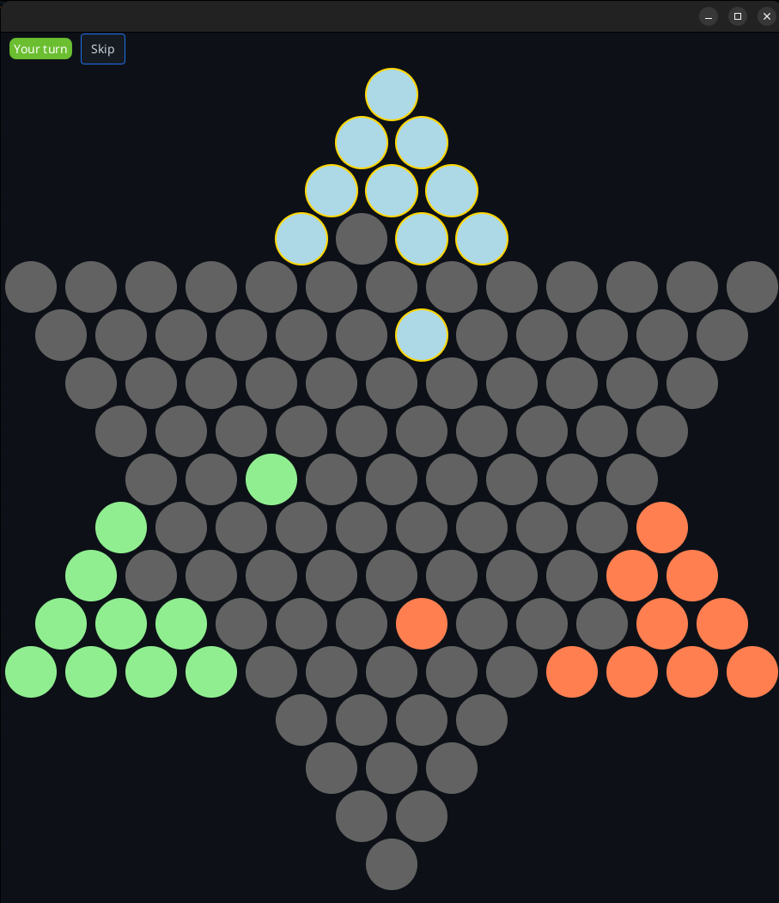
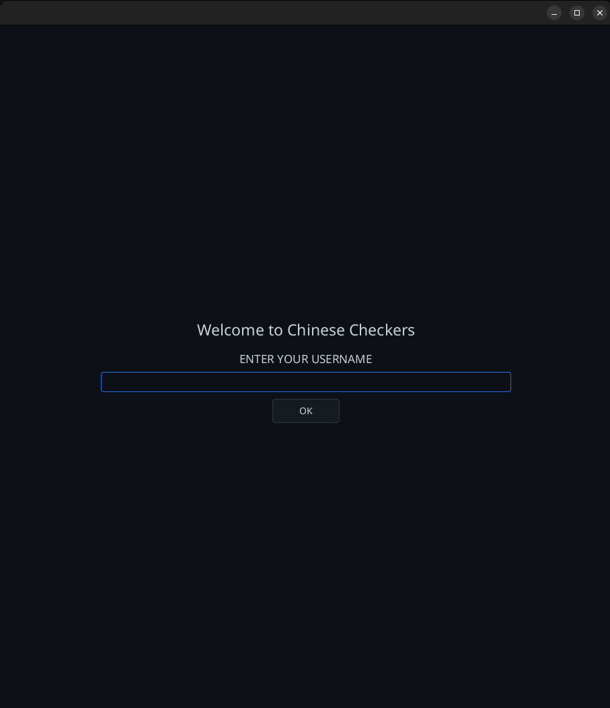
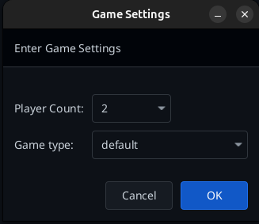
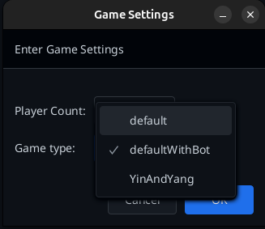

# Chinese Checkers





|  |  |
|:---------------------------------------:|:---------------------------------------:|

## Project Description
This repository contains a multiplayer Chinese Checkers game implemented in Java with both server and client architecture. The application allows players to join a game, send text messages, and make moves on a synchronized board. The game supports 2, 3, 4, or 6 players, including modes with a bot and a special "YinAndYang" board variant.

## Features
- Multiplayer gameplay with client-server communication
- Selection of player count (2, 3, 4, 6) and game variant
- Board state synchronization between all players
- Move validation for each player
- Real-time text messaging between players (CLI)
- Error handling for invalid moves
- Play against a bot
- Graphical User Interface (GUI) and Command Line Interface (CLI)

## Architecture
The project is written in Java and logically separated into the main following components:
- **Server**: Manages communication between clients and controls the game state
- **Client**: Connects to the server and allows players to interact with the game (GUI/CLI)
- **Packets**: Used for exchanging data between the server and clients
- **Board and Game**: Implements the Chinese Checkers game logic

## Technology
- **Programming Language**: Java
- **Design Patterns**:
    - **Factory** (`BoardFactory`) — for creating boards based on player count
    - **Singleton** (`GameManagerSingleton`) — ensures only one instance of the game manager exists
    - **Observer** (`ClientObserver`, Observer in GUI) — the client uses observers to react to game state changes and server events
- **Serialization**: Used for transmitting objects between server and client

## Requirements
- **Java 17+**
- **Maven** (for build & dependency management)
- **JavaFX 17** (GUI)
- **Automatic dependencies via Maven:**
  - Jackson Databind (serialization)
  - JavaFX Controls/FXML (GUI)
  - Atlantafx Base (GUI styling)
  - SLF4J + Logback (logging)
  - JUnit Jupiter, Mockito (testing)

## Installation
1. Clone the repository:
   ```bash
   git clone https://github.com/elizaluszczyk/chinese-checkers.git
   ```
2. Navigate to the project directory:
   ```bash
   cd chinese-checkers
   ```
3. Build the project:
   ```bash
   mvn package
   ```

## Usage
- **Server**:  
  Start the server with:
  ```bash
  mvn exec:java -Dexec.args="server"
  ```
- **Client (GUI)**:  
  Start the client application with:
  ```bash
  mvn exec:java -Dexec.args="client"
  ```
- **Client (CLI)**:  
  Start the client in command line mode with:
  ```bash
  mvn exec:java -Dexec.args="client-cli"
  ```
- The first connected client chooses the number of players, board type, and sets their nickname.  
  Other players also set their nicknames.  
  After all players join, the game starts automatically.
- Players can send text messages and make moves in the format:  
  ```
  MOVE x1,y1 TO x2,y2
  ```
- To leave the game, type:
  ```
  exit
  ```

## Game Rules
Chinese Checkers is a strategy board game where the goal is to move all your pieces from your triangle to the opposite triangle. Players can move to adjacent spaces or jump over other pieces (their own or opponents’) in a single turn.


## Extensions
- Graphical User Interface (GUI)
- Additional game variants support

## Author
Eliza Łuszczyk

---
